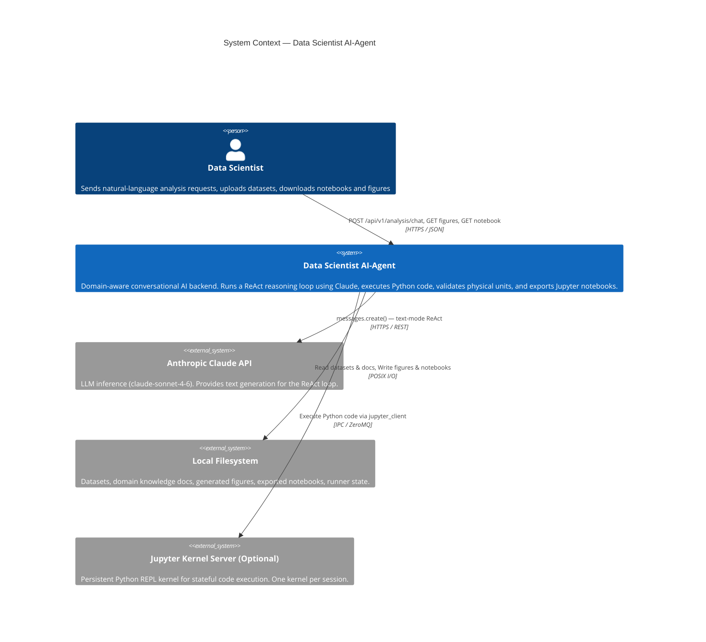
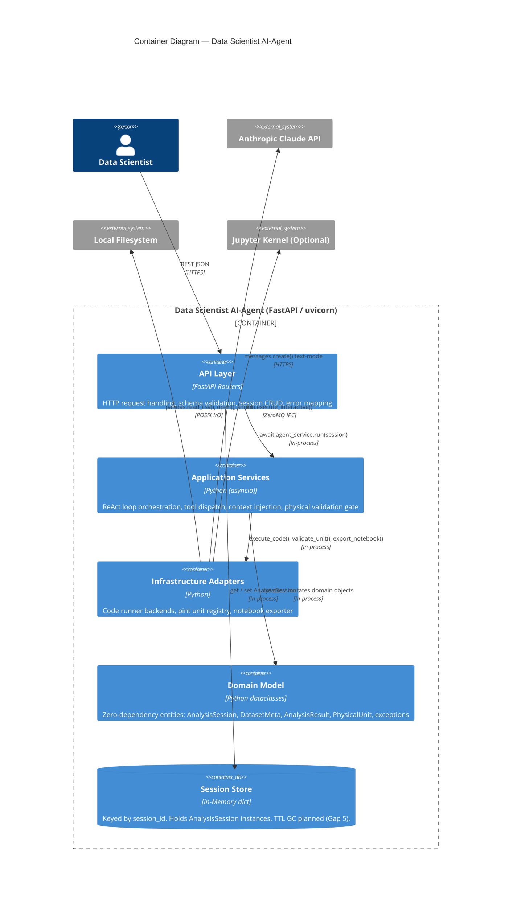
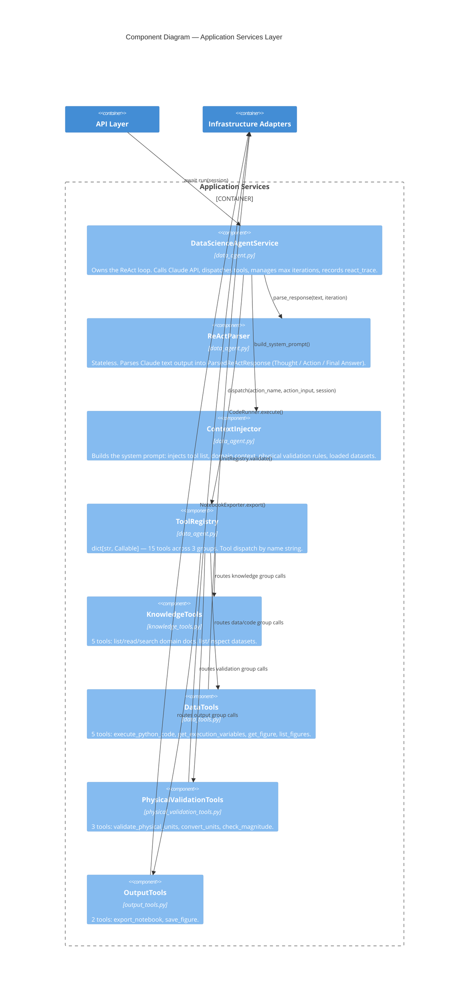

# High-Level Architecture Design

**Document Version:** 1.0  
**Status:** Approved  
**Scope:** Data Scientist AI-Agent — System-Wide HLD  
**Consults:** `SRS_robustness.md`, `09_exception_handling_design.md`  
**Informs:** Backend Engineers, DevOps

---

## 1. Architecture Style Decision

The Data Scientist AI-Agent is implemented as a **Modular Monolith** — a single FastAPI
application with clearly bounded internal modules. This is intentional for the current
scale (single-tenant, single-model deployment). The internal module boundaries are
designed to allow future extraction into microservices without rewriting business logic.

**When to re-evaluate:** Extract a service boundary when any one of the following
is true:
- The code execution runtime needs independent horizontal scaling
- A second LLM provider is added (e.g., OpenAI, Google Gemini)
- Multi-tenant isolation requirements emerge

---

## 2. C4 Level 1 — System Context Diagram



---

## 3. C4 Level 2 — Container Diagram



---

## 4. C4 Level 3 — Component Diagram (Application Layer)



---

## 5. UML Class Diagram — Domain Model

```mermaid
classDiagram
    class AgentSession {
        +str session_id
        +list~dict~ messages
        +add_user_message(content: str) None
        +add_assistant_message(content: Any) None
        +add_tool_results(tool_results: list) None
    }

    class AnalysisSession {
        +dict~str_DatasetMeta~ loaded_datasets
        +list~AnalysisResult~ analysis_results
        +list~PhysicalUnit~ unit_context
        +list~dict~ react_trace
        +dict~str_str~ figures
        +add_dataset(meta: DatasetMeta) None
        +append_react_step(thought, action, observation) None
    }

    class DatasetMeta {
        <<frozen dataclass>>
        +str file_name
        +str file_path
        +list~int~ shape
        +dict~str_str~ dtypes
        +list~dict~ sample_rows
        +dict~str_int~ null_counts
        +int file_size_bytes
    }

    class AnalysisResult {
        <<frozen dataclass>>
        +str code
        +str stdout
        +str stderr
        +list~str~ figures
        +list~str~ variables_defined
        +float execution_time_ms
        +bool success
    }

    class PhysicalUnit {
        <<frozen dataclass>>
        +str quantity
        +float value
        +str unit
        +bool is_valid
        +str message
        +to_json_dict() dict
    }

    class CodeRunner {
        <<interface>>
        +execute(code: str) AnalysisResult
        +get_state() dict
        +get_figure_b64(figure_id: str) str|None
        +shutdown() None
    }

    class SubprocessCodeRunner {
        -str _session_id
        -Path _state_file
        -dict _figures
        -dict _variables
    }

    class JupyterKernelManager {
        -str _session_id
        -KernelManager _km
        -BlockingKernelClient _kc
        -dict _figures
    }

    class AnthropicCodeExecRunner {
        -str _session_id
        -Anthropic _client
        -dict _uploaded_files
    }

    class DataScienceAgentService {
        -Anthropic _client
        -dict~str_CodeRunner~ _runners
        -int _max_iterations
        +run(session: AnalysisSession) str
        -_call_claude_with_retry(session, system_prompt) str
        -_dispatch_tool(action_name, action_input, session) str
        -_validate_final_answer(answer, session) str
    }

    class AgentError {
        <<exception>>
    }
    class ReActLoopError { <<exception>> }
    class ReActParseError { <<exception>> }
    class CodeExecutionError { <<exception>> }
    class PhysicalValidationError { <<exception>> }
    class DatasetLoadError { <<exception>> }
    class LLMAPIError { <<exception, planned>> }
    class LLMContextOverflowError { <<exception, planned>> }
    class LLMAuthenticationError { <<exception, planned>> }

    AgentSession <|-- AnalysisSession : extends
    AnalysisSession "1" *-- "0..*" DatasetMeta : loaded_datasets
    AnalysisSession "1" *-- "0..*" AnalysisResult : analysis_results
    AnalysisSession "1" *-- "0..*" PhysicalUnit : unit_context
    DataScienceAgentService "1" --> "0..*" CodeRunner : _runners[session_id]
    DataScienceAgentService --> AnalysisSession : run(session)
    CodeRunner <|.. SubprocessCodeRunner : implements
    CodeRunner <|.. JupyterKernelManager : implements
    CodeRunner <|.. AnthropicCodeExecRunner : implements
    AgentError <|-- ReActLoopError
    AgentError <|-- ReActParseError
    AgentError <|-- CodeExecutionError
    AgentError <|-- PhysicalValidationError
    AgentError <|-- DatasetLoadError
    AgentError <|-- LLMAPIError
    LLMAPIError <|-- LLMContextOverflowError
    LLMAPIError <|-- LLMAuthenticationError
```



---

## 6. Deployment View

```
┌─────────────────────────────────────────────────────────────────────┐
│                         Host / Container                            │
│                                                                     │
│  ┌─────────────────────────────────────────────────────────┐        │
│  │  uvicorn (ASGI server)                                  │        │
│  │    └── FastAPI app (create_app())                       │        │
│  │          ├── /api/v1/analysis  (analysis_router)        │        │
│  │          ├── /api/v1/datasets  (datasets_router)        │        │
│  │          └── /health           (liveness probe)         │        │
│  └─────────────────────────────────────────────────────────┘        │
│                                                                     │
│  ┌─────────────────┐  ┌──────────────────────────────────────┐      │
│  │  Datasets Dir   │  │  Code Runner State + Figures + NB    │      │
│  │  (read-only)    │  │  (written by agent during session)   │      │
│  └─────────────────┘  └──────────────────────────────────────┘      │
│                                                                     │
│  (Optional) Jupyter kernel sub-process (one per active session)     │
└─────────────────────────────────────────────────────────────────────┘
                           │
                    HTTPS outbound
                           │
                    Anthropic Claude API
                    (api.anthropic.com)
```

**Recommended deployment strategy: Blue-Green**

| Phase | Action |
|---|---|
| Build | `docker build -t agent:$VERSION .` |
| Stage | Deploy to staging; run smoke tests |
| Blue→Green | Route 100% traffic to Green; keep Blue alive for 15 min |
| Rollback | Re-route to Blue in < 1 min if health probe fails on Green |

---

## 7. High-Availability Assessment

Evaluated against `system_architecture_hld.md §2`.

| Pattern | Status | Notes |
|---|---|---|
| Retry with exponential back-off | 🟡 Designed | In `09_exception_handling_design.md`; not yet implemented |
| Timeout on outbound calls | 🟠 Partial | Code execution timeout ✅; LLM API timeout ❌ |
| Circuit Breaker (Anthropic API) | 🔴 Missing | No circuit breaker; retry loop is unbounded on 5xx |
| Bulkhead isolation | 🔴 Missing | A slow LLM call blocks the same thread pool as health checks |
| Active-Active redundancy | 🔵 N/A | Stateful in-memory store; Active-Active requires Redis |
| Active-Passive failover | 🟡 Achievable | Session store migration to Redis enables stateless replicas |

**Priority fixes (in order):**
1. Add `httpx` timeout to the `Anthropic` client constructor: `anthropic.Anthropic(timeout=60)`
2. Implement `_call_claude_with_retry()` (see `09_exception_handling_design.md §3.1`)
3. Migrate `InMemorySessionStore` → Redis for stateless horizontal scaling

---

## 8. Database / Storage Assessment

Evaluated against `system_architecture_hld.md §4`.

| Store | Current Implementation | Production Recommendation | Risk |
|---|---|---|---|
| Session state | `dict` (in-memory) | **Redis** — global low-latency key-value, session TTL | High: lost on restart |
| Datasets | Local filesystem | **Object Storage (S3/GCS)** for multi-instance | Medium: single-host only |
| Figures / Notebooks | Local filesystem | **Object Storage (S3/GCS)** | Medium: single-host only |
| Runner state (pickle) | Temp dir on local disk | **Ephemeral container volume** is acceptable | Low: session-scoped |
| Domain knowledge docs | Local filesystem | Local or object storage (read-only; deploy with image) | Low |

---

## 9. SOLID / LLD Violations Identified

Evaluated against `software_architecture_lld.md §§2,5`.

### 9.1 DIP Violation — Module-Level Singletons in `analysis.py`

```python
# CURRENT — tight coupling (DIP violation)
_agent_service = DataScienceAgentService()     # line ~20 of analysis.py
_session_store: InMemorySessionStore = InMemorySessionStore()
```

Both objects are module-level singletons. This:
- Makes the handler impossible to unit-test without importing the whole service
- Couples the API layer directly to concrete infrastructure classes
- Prevents swapping `InMemorySessionStore` → `RedisSessionStore` without code changes

**Recommended fix — FastAPI dependency injection:**

```python
# CORRECT — DIP via FastAPI Depends()
from app.services.data_agent import DataScienceAgentService
from app.services.session_store import AbstractSessionStore, InMemorySessionStore

def get_agent_service() -> DataScienceAgentService:
    return DataScienceAgentService()

def get_session_store() -> AbstractSessionStore:
    return InMemorySessionStore()

@router.post("/chat")
async def analysis_chat(
    request: AnalysisRequest,
    agent_service: DataScienceAgentService = Depends(get_agent_service),
    session_store: AbstractSessionStore = Depends(get_session_store),
) -> AnalysisResponse:
    ...
```

### 9.2 SRP Violation — `DataScienceAgentService._runners` Ownership

`DataScienceAgentService` currently owns both:
1. The ReAct reasoning loop (its core responsibility)
2. The lifecycle of `CodeRunner` instances (`_runners` dict, factory calls)

**Recommended fix:** Extract a `CodeRunnerPool` class (a session-scoped runner registry)
that manages creation, lookup, and teardown of `CodeRunner` instances.

### 9.3 Missing Exception Classes

`domain/exceptions.py` currently lacks:
- `ReActMaxIterationsError` — referenced in design docs, not implemented
- `LLMAPIError` — needed by retry logic in `09_exception_handling_design.md`
- `LLMContextOverflowError` — needed for Gap 3 fix
- `LLMAuthenticationError` — needed for Gap 1 fix
- `KernelCrashError` — needed for Gap 8 fix

These must be added to `domain/exceptions.py` before implementing the error-handling
improvements from `09_exception_handling_design.md`.

### 9.4 OCP Violation — ToolRegistry as a Dict Literal

The `TOOL_REGISTRY` dict in `data_agent.py` is built as a literal at import time.
Adding a new tool requires modifying `data_agent.py` (violates OCP). The custom
instruction in `CLAUDE.md` documents this as intentional simplicity — it is acceptable
for the current scale. If the tool count grows beyond ~25, migrate to a
`@register_tool` decorator pattern.

---

## 10. Future Microservice Extraction Boundaries

When the system needs to scale independently, extract these bounded contexts as services:

```
Current Monolith
├── [Extract 1] LLM Gateway Service
│   Responsibility: Anthropic API calls, retry, rate-limit management, prompt caching
│   Trigger: Second LLM provider added, or cost management requires centralized throttling
│
├── [Extract 2] Code Execution Service
│   Responsibility: Secure Python execution, kernel lifecycle, resource limits
│   Trigger: Code execution needs GPU access, or isolation requirements increase
│   Interface: gRPC (execute_code / get_figure / shutdown_session)
│
└── [Retain] Analysis API Service
    Responsibility: ReAct loop, session state, tool orchestration (minus code exec)
    Uses LLM Gateway + Code Execution Service via gRPC/REST
```
