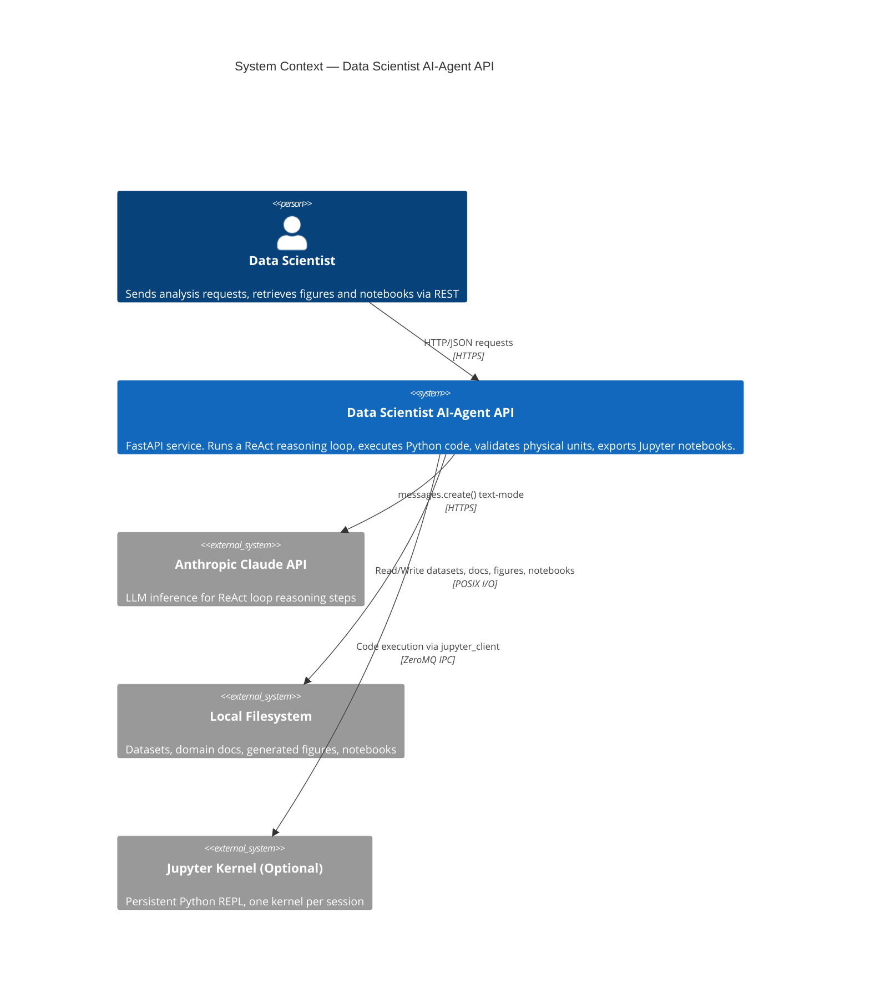
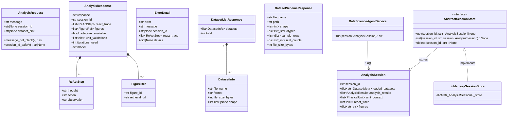

# API Interface Definition

**Document Version:** 1.0  
**Status:** Approved  
**Template:** `architecture-design/templates/api_interface_definition.md`  
**Consults:** `SRS_robustness.md`, `08_api_design.md`, `10_hld_architecture.md`

---

## 1. Service Identity

- **Service Name:** Data Scientist AI-Agent API
- **Owner Team:** AI Agent Platform
- **API Version:** `v1`
- **Base URL:** `http://{host}:8001/api/v1`
- **OpenAPI Docs:** `http://{host}:8001/docs` (Swagger UI) · `http://{host}:8001/redoc`
- **Authentication:** None (current milestone — see ADR-006)

---

## 2. C4 Context Diagram (System Level)



---

## 3. REST API Endpoints

### 3.1 Analysis Endpoints (`/api/v1/analysis`)

---

#### `POST /api/v1/analysis/chat`

- **Purpose:** Submit a natural-language analysis request. The agent runs a ReAct reasoning
  loop (up to 20 iterations), dispatching 15 tools to inspect datasets, execute Python code,
  validate physical units, and generate figures. Returns the final answer with a full
  reasoning trace.
- **Authentication:** None (current milestone)
- **Request Body:**
  ```json
  {
    "message":      "string — natural language request (1–10,000 chars, required)",
    "session_id":   "string | null — UUID4 to continue prior session; null creates a new one",
    "dataset_hint": "string | null — optional filename to pre-load before the agent starts"
  }
  ```
- **Example Request:**
  ```json
  {
    "message": "Load power_plant_data.csv, compute average thermal efficiency, and plot a histogram.",
    "session_id": null,
    "dataset_hint": "power_plant_data.csv"
  }
  ```
- **Success Response `200 OK`:**
  ```json
  {
    "response":   "string — agent's final answer text",
    "session_id": "string — UUID4 (use in follow-up requests)",
    "react_trace": [
      {
        "thought":     "string — Claude's reasoning for this step",
        "action":      "string — tool call or 'Final Answer'",
        "observation": "string — tool result or final answer text"
      }
    ],
    "figures": [
      {
        "figure_id":     "fig_000",
        "retrieval_url": "/api/v1/analysis/{session_id}/figures/fig_000"
      }
    ],
    "notebook_available":  false,
    "unit_validations":    [{ "quantity": "thermal_efficiency", "is_valid": true }],
    "iterations_used":     4,
    "model":               "claude-sonnet-4-6"
  }
  ```
- **Error Responses:**

  | Status | `error` Code          | Description                                                   |
  |--------|-----------------------|---------------------------------------------------------------|
  | `400`  | `context_overflow`    | Message history exceeds model context window. Start new session. |
  | `409`  | `session_type_mismatch` | `session_id` belongs to a different session type.            |
  | `422`  | `validation_error`    | Request body failed Pydantic schema validation.              |
  | `500`  | `react_loop_exhausted`| 20 ReAct iterations reached without Final Answer.            |
  | `500`  | `react_loop_error`    | ReAct loop encountered an unrecoverable internal error.       |
  | `500`  | `internal_error`      | Unexpected server-side error.                                 |
  | `502`  | `llm_api_error`       | Anthropic API transient error or rate-limit exhausted.        |
  | `502`  | `llm_auth_error`      | Anthropic API authentication failure (bad API key).           |

  All error bodies conform to `ErrorDetail`:
  ```json
  {
    "error":       "string — machine-readable error code",
    "message":     "string — human-readable description",
    "session_id":  "string | null",
    "react_trace": [],
    "details":     {}
  }
  ```

---

#### `GET /api/v1/analysis/{session_id}/figures/{figure_id}`

- **Purpose:** Retrieve a generated figure as raw PNG bytes.
- **Path Parameters:**
  - `session_id` — UUID4 (alphanumeric + hyphens, max 64 chars)
  - `figure_id` — e.g., `fig_000`, `fig_001`
- **Success Response `200 OK`:**
  ```
  Content-Type: image/png
  Content-Disposition: inline; filename="fig_000.png"
  Cache-Control: private, max-age=3600
  Body: <raw PNG bytes>
  ```
- **Error Responses:**

  | Status | `error` Code       | Description                                           |
  |--------|--------------------|-------------------------------------------------------|
  | `404`  | `session_not_found`| Session does not exist or has expired.                |
  | `404`  | `figure_not_found` | Figure ID not found in session.                       |
  | `422`  | `corrupted_figure` | Base64 figure data in session is corrupted (Gap 6).   |

---

#### `GET /api/v1/analysis/{session_id}/notebook`

- **Purpose:** Download the analysis as a Jupyter notebook (`.ipynb`).
  The agent must have called the `export_notebook` tool during the session before this
  endpoint is available.
- **Path Parameters:**
  - `session_id` — UUID4
- **Success Response `200 OK`:**
  ```
  Content-Type: application/octet-stream
  Content-Disposition: attachment; filename="{session_id}_{timestamp}.ipynb"
  Body: <raw .ipynb JSON>
  ```
- **Error Responses:**

  | Status | `error` Code            | Description                                         |
  |--------|-------------------------|-----------------------------------------------------|
  | `404`  | `session_not_found`     | Session does not exist.                             |
  | `404`  | `notebook_not_available`| Agent has not exported a notebook for this session. |

---

### 3.2 Dataset Endpoints (`/api/v1/datasets`)

---

#### `GET /api/v1/datasets`

- **Purpose:** List all dataset files available on the server.
- **Success Response `200 OK`:**
  ```json
  {
    "datasets": [
      {
        "file_name":       "power_plant_data.csv",
        "format":          "csv",
        "file_size_bytes": 204800,
        "shape":           null
      }
    ],
    "total": 1
  }
  ```
  Supported formats: `csv`, `xlsx`, `xls`, `parquet`, `hdf5`, `h5`, `json`.

---

#### `GET /api/v1/datasets/{name}/schema`

- **Purpose:** Inspect a specific dataset. Returns column schema, data types, sample rows,
  and null counts. Reads the first 5 rows (no full dataset load into the API response).
- **Path Parameter:** `name` — dataset filename (e.g., `power_plant_data.csv`)
- **Success Response `200 OK`:**
  ```json
  {
    "file_name":       "power_plant_data.csv",
    "path":            "/data/datasets/power_plant_data.csv",
    "shape":           [1000, 8],
    "dtypes":          { "temperature_C": "float64", "load_MW": "float64", "efficiency": "float64" },
    "sample_rows":     [{ "temperature_C": 320.5, "load_MW": 450.0, "efficiency": 0.423 }],
    "null_counts":     { "temperature_C": 0, "load_MW": 2 },
    "file_size_bytes": 204800
  }
  ```
- **Error Responses:**

  | Status | `error` Code      | Description                                          |
  |--------|-------------------|------------------------------------------------------|
  | `403`  | `path_traversal`  | `name` contains `..` or starts with `/`.             |
  | `404`  | `dataset_not_found` | File not found in datasets directory.              |
  | `422`  | `unsupported_format` | File extension not in supported set.              |

---

### 3.3 Operations Endpoint

#### `GET /health`

- **Purpose:** Liveness probe. Returns `200 OK` when the application is running.
- **Success Response `200 OK`:**
  ```json
  {
    "status": "ok",
    "env":          "development",
    "model":        "claude-sonnet-4-6",
    "code_backend": "subprocess"
  }
  ```

---

## 4. UML Class Diagram — API Layer + Domain



---

## 5. Assumptions & External Dependencies

| # | Type | Description | Risk | Fallback Strategy |
|---|---|---|---|---|
| 1 | Assumption | `session_id` is a UUID4 — format validated by Pydantic, not the session store | — | — |
| 2 | Assumption | The `dataset_hint` field is accepted but currently silently ignored (Gap 12 — stub implementation) | — | Client must not rely on it for pre-population |
| 3 | Assumption | Session state is lost on server restart (in-memory store, no persistence) | — | Document to clients; plan Redis migration for production |
| 4 | Ext. Dependency | **Anthropic Claude API** — LLM inference for every ReAct iteration | HIGH | Exponential retry (designed in `09_exception_handling_design.md`); surface `502 llm_api_error` to client |
| 5 | Ext. Dependency | **Anthropic API Key** (`ANTHROPIC_API_KEY` env var) — required at startup | HIGH | Fast-fail at startup with clear error; `502 llm_auth_error` at runtime |
| 6 | Ext. Dependency | **Local Filesystem** — datasets directory must be readable; figures/notebooks writable | MEDIUM | `404 dataset_not_found` on missing file; log `IOError` and return `500 internal_error` |
| 7 | Ext. Dependency | **Jupyter Kernel Server** (optional) — only required when `CODE_EXECUTION_BACKEND=jupyter` | LOW | Falls back to `subprocess` backend; `KernelCrashError` surfaces as `500 kernel_crash` |
| 8 | Assumption | `CORS allow_origins=["*"]` is acceptable in development only; production must set `CORS_ORIGINS` env var (Gap 14 / EPIC-6) | MEDIUM | Env-aware CORS config (see `08_api_design.md §13`) |
| 9 | Assumption | No authentication or authorization is implemented in v1. All endpoints are publicly accessible. | HIGH | OAuth 2.0 / API key auth planned for v2 (out of scope for current milestone) |
| 10 | Assumption | Physical unit validation warnings are advisory only. Final Answer is never blocked by a unit warning — only annotated. | — | — |
